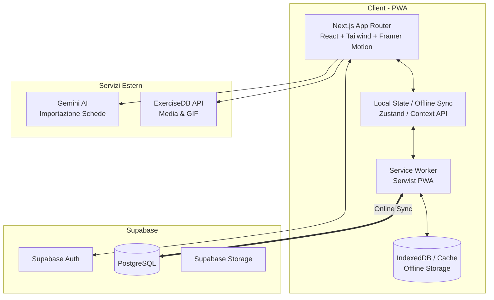
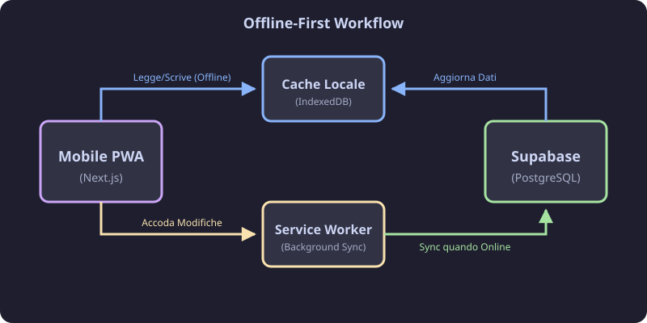
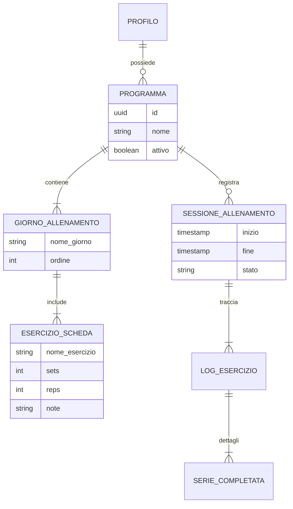

# 🏋️ Gym Tracker App 

Una PWA mobile-first dal design premium (glassmorphism, animazioni fluide) per la gestione di schede da palestra, allenamenti guidati, storico, analytics e importazione assistita da AI. Progettata con un'architettura offline-first per non perdere mai un colpo in palestra, anche senza connessione.


---

## 🏗️ Architettura Tecnica

L'app si basa su uno stack moderno, orientato alle performance e all'affidabilità offline.



## 🔄 Workflow Allenamento (Offline-First)

L'esperienza di allenamento è concepita per funzionare in zone con scarsa copertura (es. sale pesi interrate). I dati vengono salvati localmente e sincronizzati non appena la connessione torna disponibile.

<p align="center">
  
</p>

## 📊 Modello Dati

Il database è strutturato per gestire in modo gerarchico programmi complessi e tracciare le sessioni individuali per calcolare statistiche avanzate.



---

## 🚀 Funzionalità Principali

- **Design Premium & UX Focalizzata**: Interfaccia studiata per il minimo carico cognitivo. Uso estensivo di *glassmorphism*, feedback tattile visivo (Framer Motion) e bottom sheet (mobile-first).
- **Gestione Allenamento**: Player allenamento con controlli rapidi (Pausa/Riprendi), focus su un solo esercizio alla volta, e raggruppamento intelligente.
- **Importazione AI**: Integrazione con Gemini AI per importare schede testuali o immagini direttamente nel database, con step di revisione.
- **PWA & Offline**: Registrazione tramite Service Worker (Serwist) per funzionamento garantito in palestra senza rete.
- **Analytics & Reportistica**: Progressi tracciati con colori semantici e trasformati in insight (Andamento pesi, volume totale, ecc.).

---

## 🛠️ Sviluppo & Setup

### Requisiti
- Node.js (v18+)
- Supabase CLI (opzionale, per gestione db locale)
- Chiavi API per Gemini (se si usa l'importazione AI)

### Variabili d'Ambiente (`.env.local`)

L'app richiede le chiavi per Supabase e per l'integrazione AI. **Le chiavi AI devono restare esclusivamente server-side.**

```env
NEXT_PUBLIC_SUPABASE_URL=your-supabase-url
NEXT_PUBLIC_SUPABASE_ANON_KEY=your-anon-key

# AI Provider Configuration
AI_PROVIDER=gemini
GEMINI_API_KEY=your-gemini-api-key
GEMINI_MODEL=gemini-2.5-flash
```

### Migrazioni Database

Se si effettuano aggiornamenti, assicurarsi che le migrazioni di Supabase siano state applicate correttamente. Le migrazioni sono presenti nella cartella `supabase/migrations/`.
Migrazioni chiave recenti necessarie:
- `009_workout_plan_history.sql`
- `010_session_trash_pause.sql`

### Aggiornamento di una Versione (Deploy Locale/Manuale)
Se copi manualmente i file per aggiornare l'app, **mantieni intatte** le seguenti cartelle/file:
```text
node_modules/
.env.local
package-lock.json
.git/
```
Dopo aver sovrascritto, esegui:
```bash
npm run dev
npm run build
```

---

## 💡 Principi per i Contributor / Agent (AGENTS.md)
Per chiunque (umano o AI) metta mano al codice:
1. **Premium Look & Feel**: Non usare colori base. Sfrutta i token semantici (`gym-accent`, `gym-bg`, `gym-surface`). Tutto deve avere un'animazione attiva (Framer Motion).
2. **Offline-First**: Qualsiasi mutazione durante un workout deve supportare il salvataggio offline tramite i sync manager integrati.
3. **Bottom Sheets / Portals**: I modali devono usare `createPortal` sul `document.body` per evitare problemi di stacking context con Framer Motion.
