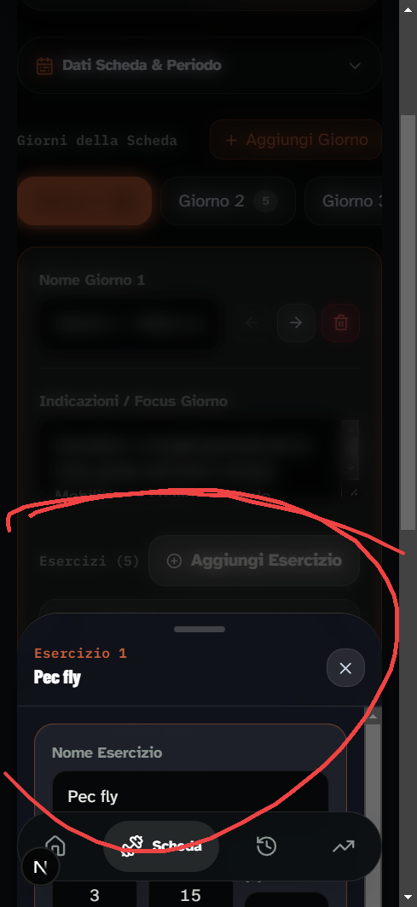
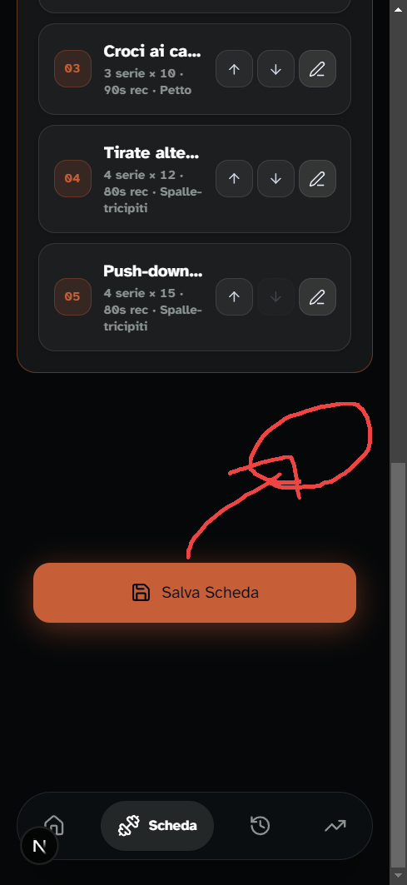
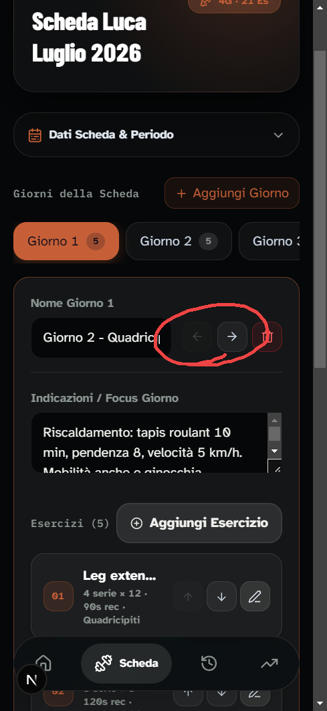

# 🚀 Report Revisione UI (Generato da Visual AI Bug Tracker)

**Data Sessione:** 7/22/2026 - 9:32:10 PM
**Totale Bug Rilevati:** 3

---

## 🐛 Bug #1: iPhone 14
* **Rotta / URL:** `http://localhost:4000/`
* **Dispositivo / Viewport:** iPhone 14
* **Ora scatto:** 9:30:56 PM

### 📝 Descrizione del Problema:
> appare sotto ma molto male, dovrebbe essere fissato sulla schermata non così libero

### 📸 Riferimento Visivo Annotato:


<details>
<summary>🔎 Clicca per espandere il Frammento HTML / DOM</summary>

```html
<div class="sticky top-0 z-30 flex flex-col items-center border-b border-white/10 bg-[#0f121a]/90 px-4 pt-3 pb-3.5 backdrop-blur-2xl rounded-t-[2.5rem]"><div class="h-1.5 w-12 rounded-full bg-white/20 mb-3"></div><div class="flex w-full items-center justify-between gap-3"><div class="min-w-0"><p class="technical-label text-gym-accent">Esercizio 1</p><h2 class="truncate text-lg font-extrabold text-white">Pec fly</h2></div><button type="button" class="flex h-9 w-9 shrink-0 items-center justify-center rounded-2xl border border-white/10 bg-white/10 text-slate-300 hover:bg-white/20 active:scale-95 transition" aria-label="Chiudi"><svg xmlns="http://www.w3.org/2000/svg" width="18" height="18" viewBox="0 0 24 24" fill="none" stroke="currentColor" stroke-width="2" stroke-linecap="round" stroke-linejoin="round" class="lucide lucide-x" aria-hidden="true"><path d="M18 6 6 18"></path><path d="m6 6 12 12"></path></svg></button></div></div>
```
</details>

---

## 🐛 Bug #2: iPhone 14
* **Rotta / URL:** `http://localhost:4000/`
* **Dispositivo / Viewport:** iPhone 14
* **Ora scatto:** 9:31:25 PM

### 📝 Descrizione del Problema:
> il tasto salva deve stare fisso qui diciamo

### 📸 Riferimento Visivo Annotato:


<details>
<summary>🔎 Clicca per espandere il Frammento HTML / DOM</summary>

```html
<button type="button" class="flex w-full items-center justify-center gap-2.5 rounded-2xl border border-gym-accent/50 bg-gym-accent py-4 text-base font-extrabold text-slate-950 shadow-[0_6px_30px_rgba(198,95,55,0.45)] transition-all hover:brightness-110 active:scale-95 disabled:opacity-50" tabindex="0" style="transform: scale(0.980908);"><svg xmlns="http://www.w3.org/2000/svg" width="20" height="20" viewBox="0 0 24 24" fill="none" stroke="currentColor" stroke-width="2" stroke-linecap="round" stroke-linejoin="round" class="lucide lucide-save" aria-hidden="true"><path d="M15.2 3a2 2 0 0 1 1.4.6l3.8 3.8a2 2 0 0 1 .6 1.4V19a2 2 0 0 1-2 2H5a2 2 0 0 1-2-2V5a2 2 0 0 1 2-2z"></path><path d="M17 21v-7a1 1 0 0 0-1-1H8a1 1 0 0 0-1 1v7"></path><path d="M7 3v4a1 1 0 0 0 1 1h7"></path></svg><span>Salva Scheda</span></button>
```
</details>

---

## 🐛 Bug #3: iPhone 14
* **Rotta / URL:** `http://localhost:4000/workout/edit`
* **Dispositivo / Viewport:** iPhone 14
* **Ora scatto:** 9:31:48 PM

### 📝 Descrizione del Problema:
> questi tasti non hanno molto senso

### 📸 Riferimento Visivo Annotato:


<details>
<summary>🔎 Clicca per espandere il Frammento HTML / DOM</summary>

```html
<main class="officina-page mode-consultation mx-auto flex min-h-dvh max-w-md flex-col bg-gym-bg text-gym-soft pb-52"><div class="flex-1 px-4 py-5"><div style="opacity: 1; transform: none;"><div style="opacity: 1; filter: blur(0px); transform: none;"><div class="space-y-4 pb-28"><a class="inline-flex items-center gap-2 text-sm font-bold text-slate-300" href="/workout"><svg xmlns="http://www.w3.org/2000/svg" width="16" height="16" viewBox="0 0 24 24" fill="none" stroke="currentColor" stroke-width="2" stroke-linecap="round" stroke-linejoin="round" class="lucide lucide-arrow-left" aria-hidden="true"><path d="m12 19-7-7 7-7"></path><path d="M19 12H5"></path></svg> Torna alla scheda</a><div class="relative space-y-6 pb-32"><header class="app-hero flex items-start justify-between gap-4"><div><p class="technical-label text-gym-accent">Editor Scheda</p><h1 class="mt-1 text-3xl font-extrabold leading-tight text-white">Scheda Luca Luglio 2026</h1></div><div class="flex items-center gap-2 rounded-full border border-gym-accent/30 bg-gym-accent/10 px-3.5 py-1.5 text-xs font-extrabold text-gym-accent backdrop-blur-md shadow-sm shrink-0"><svg xmlns="http://www.w3.org/2000/svg" width="14" height="14" viewBox="0 0 24 24" fill="none" stroke="currentColor" stroke-width="2" stroke-linecap="round" stroke-linejoin="round" class="lucide lucide-dumbbell" aria-hidden="true"><path d="M17.596 12.768a2 2 0 1 0 2.829-2.829l-1.768-1.767a2 2 0 0 0 2.828-2.829l-2.828-2.828a2 2 0 0 0-2.829 2.828l-1.767-1.768a
```
</details>

---

